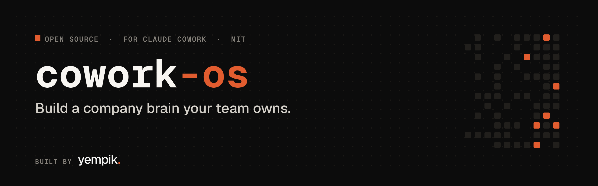
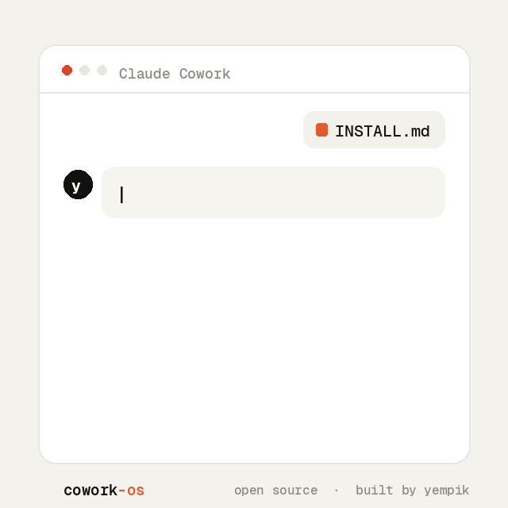
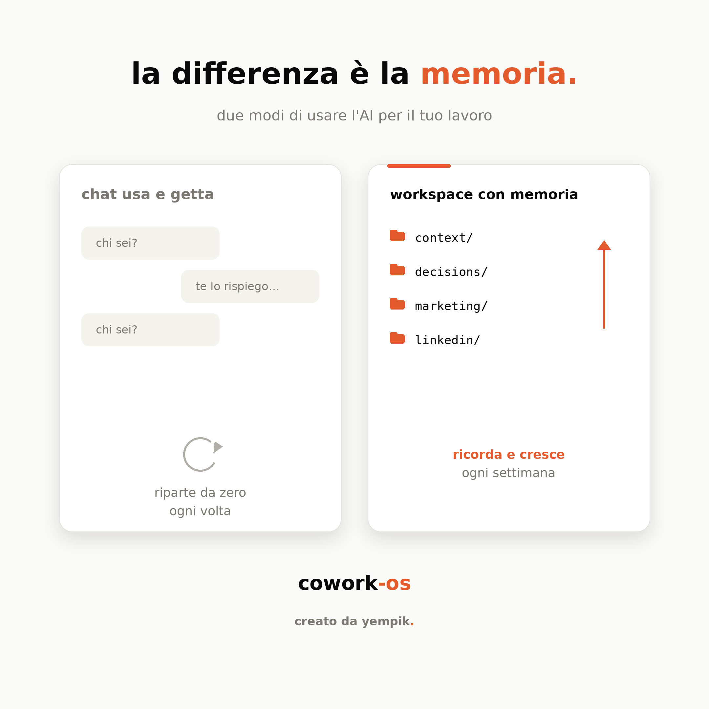

<div align="center">



# cowork-os

**Give your Claude Cowork project a memory you can read and edit.**
*Dai al tuo progetto Claude Cowork una memoria che puoi leggere e correggere.*

<sub>Open-source, MIT. An operating system in the boring sense: folder conventions and a memory protocol, not a kernel.</sub>

[](./LICENSE)
&nbsp;
&nbsp;
&nbsp;

Folder conventions · a living-memory protocol · outcome-driven workflows ·
and three flagship modules (LinkedIn Growth OS, Missions, Scheduled tasks).

Built and battle-tested by [**Yempik**](https://yempik.com) · maintained by Raffaele Zarrelli & Simone Bova.

<br />



_Paste the installer, answer 6 questions, and Claude builds your workspace._

</div>

---

## EN: What this is

Most AI is a brilliant intern you have to stand over: it finishes a task, stops, and waits for you to point at the next one. cowork-os gives Claude Cowork a brain, so it stops waiting and runs your work.

The unglamorous truth about that brain: it is just Markdown files you can open and edit. Decisions (each with a status), context, open questions, what changed this week. The agent reads them when a task starts and writes back when it ends. No database, no vector store, no black box.

Because that brain is on disk and you can read and correct it, the agent runs real work (your campaigns, your site, your briefs, your outreach drafts) while staying grounded and under your control. The state is inspectable, the outside actions are draft-only, and nothing runs behind your back. That is the deliberate difference from a self-hosted autonomous agent.

It is not a separate app and it has no dependencies. You load it into a Claude Cowork project (or any agentic workspace) and you have a working environment in a few minutes, no training required.

<div align="center">

</div>

### How it works (the stack)

There is no separate runtime or backend. The agent is Claude Cowork itself. cowork-os is what you load into the project to direct it:

- **State** — the Markdown files the agent reads when a task starts and writes back when it ends.
- **Behavior** — the Project Instructions that make it check sources, separate facts from assumptions, and run a Memory Update.
- **Recurrence** — scheduled tasks: prompts Cowork runs on a cadence (like cron), so routines run on their own.
- **Optional plugin** — slash commands plus an always-on skill, for one-command setup and use.

The "multiple agents" are separate runs and sub-agents that coordinate through the shared files, not a fleet of services. The core is just files plus instructions, so it is not locked to one provider: Cowork is the featured host (scheduled tasks, native plugin), but the method points at any agent that reads files.

### What's inside

| Layer | What it gives you |
|---|---|
| **Core OS** | A clean folder structure (`context/`, `marketing/`, `website/`, `decisions/`, `reviews/`) and the **Memory Update** protocol that keeps it alive. |
| **Project Instructions** | The system prompt that turns a generic assistant into a strategist that always checks sources, separates facts from assumptions, and updates memory. |
| **Relentless Outcome Workflow** | A method for *ambitious missions*: pursue an outcome, not a task. Route maps, evidence logs, stop conditions. |
| 🚩 **LinkedIn Growth OS** | A full system to turn know-how into authority and leads: strategy, a content engine (6 formats + hook/CTA banks), a reputation engine, an engagement playbook, and a runnable 8-step editor. |
| 🚩 **Missions** | The outcome framework, packaged as a copy-paste mission template. |
| 🚩 **Scheduled tasks** | 10 ready-to-use recurring automations (weekly marketing pulse, campaign review, workspace maintenance, trend hunter, engagement radar, mission review, daily founder brief…) as prompt templates + a setup guide. |

### Why it works

- **State you can read and correct.** Decisions (with a status), assumptions and open questions live in files you open and fix, not in a thread that scrolls away or a memory you can only query and hope.
- **It runs the work, not just remembers it.** With the state on disk, the agent holds the thread across long, multi-step workflows, stays grounded (it re-derives and invents less), and proposes the next step instead of waiting for you.
- **Evidence over vibes.** The Project Instructions force it to check real sources and label facts vs assumptions vs recommendations.
- **Outcome over output.** The mission workflow refuses to stop at "I sent the email."
- **Adopt in 30 minutes.** Copy the folder, paste the Project Instructions, fill the placeholders.

### Quick start, three ways

**🟢 Path A, one command (plugin, fastest).** On Claude Cowork or Code, add the marketplace and install the plugin:

```
/plugin marketplace add yempik-ai/cowork-os
/plugin install cowork-os@cowork-os
```

Then run `/cowork-os:install`: Claude interviews you (about 5 minutes) and **generates your whole workspace, pre-configured**, with no copy-paste and no files to understand.

**Path B, guided setup.** No plugin support? Copy the folder into a new Cowork project, paste the contents of [`INSTALL.md`](./INSTALL.md) into the chat, and answer ~6 questions. Same result. It even surfaces capabilities most people don't know exist (scheduled automations, mission mode, skills). Already have notes, a deck, or a messy folder? Drop it in `_inbox/` and Claude organizes it into the workspace for you.

**Path C, manual.** Prefer to do it by hand, or not on Cowork? Fill [`PROJECT_INSTRUCTIONS.md`](./PROJECT_INSTRUCTIONS.md) and the `context/` templates yourself, see [`GETTING_STARTED.md`](./GETTING_STARTED.md). Every file ships as a skeleton **plus a sanitized Yempik example**.

Then just work, and end important tasks with a **Memory Update**, so the workspace compounds week over week.

---

## IT: Cos'è

La maggior parte dell'AI è uno stagista brillante che devi avere sempre sopra le spalle: finisce un task, si ferma, e aspetta che tu gli indichi il prossimo. cowork-os dà a Claude Cowork un cervello, così smette di aspettare e fa girare il tuo lavoro.

La verità poco glamour su quel cervello: sono solo file Markdown che apri e modifichi. Decisioni (ognuna con uno stato), contesto, domande aperte, cosa è cambiato questa settimana. L'agente li legge quando un task inizia e li riscrive quando finisce. Niente database, niente vector store, niente scatola nera.

Siccome quel cervello è su disco e puoi leggerlo e correggerlo, l'agente fa girare lavoro vero (le tue campagne, il tuo sito, i tuoi brief, le bozze di outreach) restando ancorato e sotto il tuo controllo. Lo stato è ispezionabile, le azioni verso l'esterno sono solo bozze, e niente gira alle tue spalle. È la differenza voluta da un agente autonomo self-hosted.

Non è un'app separata e non ha dipendenze. Lo carichi in un progetto Claude Cowork (o in qualsiasi workspace agentico) e hai un ambiente funzionante in pochi minuti, senza bisogno di formazione.

### Come funziona (lo stack)

Non c'è un runtime o un backend separato. L'agente è Claude Cowork stesso. cowork-os è ciò che carichi nel progetto per guidarlo:

- **Stato** — i file Markdown che l'agente legge quando un task inizia e riscrive quando finisce.
- **Comportamento** — le Project Instructions che lo fanno controllare le fonti, separare fatti e ipotesi, e fare una Memory Update.
- **Ricorrenza** — gli scheduled task: prompt che Cowork lancia a cadenza (tipo cron), così le routine girano da sole.
- **Plugin (opzionale)** — slash command più una skill sempre attiva, per setup e uso con un comando.

I "più agenti" sono run e sotto-agenti che si coordinano attraverso i file condivisi, non una flotta di servizi. Il core è solo file più istruzioni, quindi non è legato a un solo provider: Cowork è l'host featured (scheduled task, plugin nativo), ma il metodo lo punti su qualsiasi agente che legge file.

### Cosa c'è dentro

| Livello | Cosa ti dà |
|---|---|
| **Core OS** | Una struttura di cartelle pulita (`context/`, `marketing/`, `website/`, `decisions/`, `reviews/`) e il protocollo **Memory Update** che la tiene viva. |
| **Project Instructions** | Il system prompt che trasforma un assistente generico in uno strategist che controlla sempre le fonti, separa fatti e ipotesi, e aggiorna la memoria. |
| **Relentless Outcome Workflow** | Un metodo per le *missioni ambiziose*: persegui un outcome, non un task. Route map, evidence log, stop condition. |
| 🚩 **LinkedIn Growth OS** | Un sistema completo per trasformare know-how in autorevolezza e lead: strategia, content engine (6 format + hook/CTA bank), reputation engine, engagement playbook, editor a 8 step. |
| 🚩 **Missions** | Il framework outcome, pacchettizzato come template di missione copia-incolla. |
| 🚩 **Scheduled tasks** | 10 automazioni ricorrenti pronte all'uso (pulse marketing, review campagne, manutenzione workspace, trend hunter, engagement radar, review missioni, brief founder giornaliero…) come template di prompt + guida. |

### Perché funziona

- **Stato che leggi e correggi.** Decisioni (con uno stato), ipotesi e domande aperte vivono in file che apri e correggi, non in un thread che scorre via o in una memoria che puoi solo interrogare e sperare.
- **Fa girare il lavoro, non lo ricorda soltanto.** Con lo stato su disco, l'agente tiene il filo sui workflow lunghi e a più passi, resta ancorato (ri-deduce e inventa di meno) e propone il passo dopo invece di aspettarti.
- **Evidenze, non sensazioni.** Le Project Instructions lo obbligano a controllare fonti reali ed etichettare fatti, ipotesi e raccomandazioni.
- **Outcome, non output.** Il workflow delle missioni si rifiuta di fermarsi a "ho mandato la mail".
- **Adozione in 30 minuti.** Copia la cartella, incolla le Project Instructions, compila i placeholder.

### Avvio rapido, tre modi

**🟢 Via A, un comando (plugin, il più veloce).** Su Claude Cowork o Code, aggiungi il marketplace e installa il plugin:

```
/plugin marketplace add yempik-ai/cowork-os
/plugin install cowork-os@cowork-os
```

Poi lancia `/cowork-os:install`: Claude ti intervista (circa 5 minuti) e **genera tutto il workspace già configurato**, senza copia-incolla e senza file da capire.

**Via B, setup guidato.** Niente plugin? Copia la cartella in un progetto Cowork nuovo, incolla il contenuto di [`INSTALL.md`](./INSTALL.md) nella chat e rispondi a ~6 domande. Stesso risultato. Ti propone anche funzioni che quasi nessuno sa che esistono (automazioni schedulate, mission mode, skill). Hai già note, un deck o una cartella disordinata? Buttala in `_inbox/` e Claude la organizza nel workspace per te.

**Via C, manuale.** Preferisci farlo a mano, o non sei su Cowork? Compila tu [`PROJECT_INSTRUCTIONS.md`](./PROJECT_INSTRUCTIONS.md) e i template in `context/`, vedi [`GETTING_STARTED.md`](./GETTING_STARTED.md). Ogni file è uno scheletro **più un esempio Yempik sanitizzato**.

Poi lavora e basta, e chiudi i task importanti con una **Memory Update**, così il workspace si arricchisce settimana dopo settimana.

---

## Structure / Struttura

```
cowork-os/
├── INSTALL.md                   # 🟢 guided setup, paste this, answer questions, done
├── capabilities.md              # what Claude can set up for you (the installer's "brain")
├── PROJECT_INSTRUCTIONS.md      # the system prompt (auto-filled by the installer, or by hand)
├── PROJECT_STRUCTURE.md         # how the knowledge base is organized
├── cowork.config.example.md     # every placeholder, in one place
├── GETTING_STARTED.md           # setup, both paths (EN + IT)
├── CONTRIBUTING.md
├── workflows/                   # Relentless Outcome Workflow
├── context/                     # overview · positioning · services · tone of voice
├── marketing/                   # strategy · campaigns · content
├── website/                     # notes · backlog · homepage copy
├── decisions/                   # decisions log · open questions
├── reviews/                     # weekly + maintenance review templates
├── missions/                    # 🚩 outcome-driven mission template
├── products/                    # product-workstream pattern
├── linkedin/                    # 🚩 LinkedIn Growth OS
├── scheduled-tasks/             # 🚩 recurring automations ("routines") + setup guide
├── skills/                      # skills that pair with the kit + your own
├── _inbox/                      # drop unsorted material → "process the inbox"
└── examples/yempik/             # 🟢 a complete, sanitized, real workspace
```

## License

[MIT](./LICENSE) © 2026 Yempik Ltd. Use it, fork it, ship it. A credit back to Yempik is appreciated, not required.

## Credits

Created by **Yempik**, a software house specialized in software, automation and AI agents, maintained by Raffaele. If this helped you, a star ⭐ and a tag on LinkedIn make our day.
